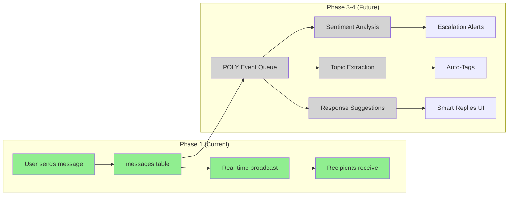
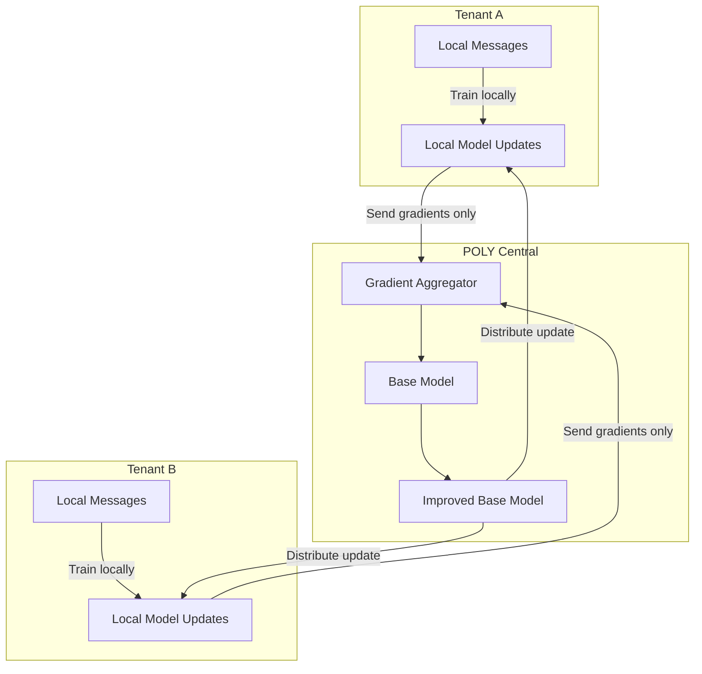

# AI Engineering Plan: Real-Time Chat Application

## CRITICAL: Development Server Constraints

**NEVER run `npm run dev` in the background:**
- If you need to start the dev server, inform the user and let them start it manually
- NEVER use `run_in_background: true` with Bash tool for `npm run dev`
- Dev servers must run in the terminal for proper log visibility and clean restarts
- This is a strict requirement across all agents

## Executive Summary

**Phase 1 Scope: No AI Features**

The Real-Time Chat Application Phase 1 focuses exclusively on core messaging functionality: 1:1 and group conversations, real-time message delivery via WebSocket, presence indicators, and file attachments. **No AI or POLY Engine capabilities are included in Phase 1.**

This document serves as a roadmap for future AI integration (Phases 3-4), outlining where AI could enhance the chat experience, data considerations for federated learning, and the path to Tech Assist (POLY) integration within conversations.

---

## 1. AI Phase Determination

### 1.1 Phase 1 Classification

**Recommended Phase:** None (AI Deferred)

| Phase | Status | Description |
|-------|--------|-------------|
| Phase 1 | **Current** | Core chat functionality - No AI |
| Phase 2 | Planned | Attachments, reactions, search - No AI |
| Phase 3 | Future | AI enhancements (Passive) |
| Phase 4 | Future | Tech Assist integration (Assistive) |

### 1.2 Phase Rationale

**Why No AI in Phase 1:**

1. **Foundation First**: Real-time messaging infrastructure must be stable before adding AI layers
2. **User Adoption**: Users need to adopt the core chat experience before AI enhancements add value
3. **Data Collection**: AI features require conversation data to train on; Phase 1 establishes the data pipeline
4. **Complexity Isolation**: Separating AI from core chat reduces Phase 1 risk and testing scope
5. **Resource Allocation**: Engineering focus is on WebSocket reliability and UI/UX polish

**AI Readiness by Phase End:**

By completing Phase 1, the platform will have:
- Message history stored in queryable format (messages table)
- Conversation context (participants, organization scope)
- User behavior patterns (message frequency, response times)
- Foundation for sentiment analysis (text content in structured format)

---

## 2. POLY Engine Integration (Future Roadmap)

### 2.1 Integration Points (Phases 3-4)

| Feature | POLY Component | Purpose | Target Phase |
|---------|----------------|---------|--------------|
| Message Suggestions | Text Completion | Smart reply suggestions | Phase 3 |
| Conversation Summarization | Document Analysis | Summarize long conversations | Phase 3 |
| Sentiment Analysis | Emotion Detection | Escalation alerts for managers | Phase 3 |
| Tech Assist Chat | POLY Conversational | Ask POLY questions in chat | Phase 4 |
| Intelligent Search | Semantic Search | Natural language message search | Phase 4 |
| Auto-Categorization | Classification | Tag conversations by topic | Phase 4 |

### 2.2 Future Data Flow to POLY



### 2.3 Architecture Considerations

The current Phase 1 architecture supports future AI integration without modification:

| Phase 1 Element | AI Integration Point |
|-----------------|---------------------|
| `messages.content` (TEXT) | Input for NLP processing, sentiment analysis |
| `messages.created_at` (TIMESTAMPTZ) | Response time analytics, urgency patterns |
| `conversation_participants` | Context for who is involved, relationship mapping |
| `organization_id` scoping | Multi-tenant AI model isolation |
| WebSocket channel | Real-time AI suggestion delivery |

---

## 3. Tech Assist Scenarios (Phase 4 Roadmap)

### 3.1 Assistance Triggers

| Trigger | Context | AI Response | Complexity |
|---------|---------|-------------|------------|
| User types "?" or "help" | Conversation context | Suggest relevant documentation | 3 SP |
| Manager keyword detected | "escalate", "urgent" | Notify supervisors with summary | 5 SP |
| Question pattern detected | Technical question | Offer to summon POLY assistant | 5 SP |
| Long conversation (>50 msgs) | Group chat | Offer conversation summary | 8 SP |
| Repeated question pattern | Same question asked often | Suggest FAQ creation | 5 SP |
| Stalled conversation | No response in 4+ hours | Reminder or escalation | 3 SP |

### 3.2 User Prompts (Phase 4)

**Invocation Patterns:**

```
@poly [question]          - Direct invocation in any conversation
/ask [question]           - Slash command for Tech Assist
"Ask POLY" button         - UI element in message composer
Long-press on message     - "Ask POLY about this" context action
```

**Example User Interactions:**

| User Input | POLY Response |
|------------|---------------|
| "@poly how do I configure the panel at Site 12?" | Retrieves Site 12 documentation, provides step-by-step guide |
| "@poly summarize this conversation" | Generates bullet-point summary of last 50 messages |
| "@poly who usually handles access control issues?" | Analyzes conversation history, identifies relevant team members |
| "@poly what did we decide about the Johnson project?" | Searches conversation history for decisions and action items |

### 3.3 Response Patterns (Phase 4)

```typescript
// AI Response Format for Chat Integration
interface TechAssistChatResponse {
  // The AI-generated response
  content: string;

  // Confidence in response accuracy (0-1)
  confidence: number;

  // Sources used to generate response
  sources: Array<{
    type: 'documentation' | 'conversation_history' | 'knowledge_base';
    reference: string;
    relevance: number;
  }>;

  // Suggested follow-up actions
  actions?: Array<{
    label: string;
    action: 'create_task' | 'send_to_channel' | 'schedule_meeting' | 'link_document';
    payload: Record<string, unknown>;
  }>;

  // Metadata for audit and improvement
  metadata: {
    model_version: string;
    processing_time_ms: number;
    tokens_used: number;
  };
}
```

---

## 4. Prompt Engineering (Phase 3-4)

### 4.1 System Prompts (Future Implementation)

**Smart Reply System Prompt (Phase 3):**

```
You are a reply suggestion assistant for Pierce Desk, a platform for security integration teams.

Context:
- You are helping {user_role} respond to a message from {sender_role}
- The conversation is about {extracted_topic}
- The organization {org_name} specializes in {org_specialty}

Rules:
- Suggest 3 short, professional responses (max 20 words each)
- Maintain the tone of the existing conversation
- Never suggest responses that commit to deadlines without user confirmation
- Include one positive acknowledgment, one question, and one actionable response

Message to respond to: {last_message}
```

**Conversation Summary System Prompt (Phase 3):**

```
Summarize the following conversation for a security integration team member.

Requirements:
- Maximum 5 bullet points
- Focus on: decisions made, action items, open questions
- Include participant names for action items
- Use technical terminology appropriately
- Flag any unresolved urgent issues

Conversation:
{conversation_messages}
```

### 4.2 User Prompt Templates (Phase 4)

| Scenario | Template | Input Variables |
|----------|----------|-----------------|
| Question to POLY | "User {user_name} asks in {conversation_name}: {question}" | user_name, conversation_name, question |
| Summarize thread | "Summarize messages from {start_date} to {end_date} in conversation {id}" | start_date, end_date, id |
| Find similar | "Find conversations similar to this topic: {topic}" | topic |
| Extract action items | "List action items from conversation {id} for user {user_name}" | id, user_name |

### 4.3 Response Formatting

**Phase 3-4 AI responses will follow these display patterns:**

| Response Type | Display Format |
|---------------|----------------|
| Smart Reply | Button row above message input (max 3 options) |
| Conversation Summary | Collapsible card at conversation top |
| POLY Answer | Message from "POLY" bot with distinct avatar and styling |
| Sentiment Alert | Toast notification to managers with link to conversation |
| Search Results | Panel overlay with message previews and deep links |

---

## 5. Training Data Requirements (Future)

### 5.1 Data Sources (Phase 3 Preparation)

| Source | Type | Volume Estimate | Access Model |
|--------|------|-----------------|--------------|
| `messages.content` | Text | 100K-1M messages/org/year | Read via SQL with consent |
| Conversation context | Metadata | Participant roles, org type | Aggregate analytics |
| User feedback | Labels | Thumbs up/down on suggestions | Explicit user action |
| Response patterns | Behavioral | Time-to-reply, message length | Implicit collection |

### 5.2 Data Schema (Future)

```typescript
// Training data format for POLY Chat Assistant
interface ChatTrainingRecord {
  // The input context
  input: {
    conversation_snippet: string[];  // Last 5 messages
    user_role: string;               // sender's role
    org_type: string;                // organization specialty
    time_of_day: string;             // for context
  };

  // The expected output
  output: {
    response: string;                // What user actually sent
    response_time_ms: number;        // How long they took
  };

  // Feedback if available
  feedback?: {
    rating: 'positive' | 'negative' | 'neutral';
    user_edited: boolean;
    edit_distance?: number;
  };

  // Privacy metadata
  privacy: {
    anonymized: boolean;
    consent_version: string;
    data_region: string;
  };
}
```

### 5.3 Data Quality Requirements

**Phase 3 Prerequisites:**

- [ ] Anonymization pipeline for training data extraction
- [ ] Bias detection for organization-specific language patterns
- [ ] Privacy compliance review (GDPR, SOC 2)
- [ ] User consent mechanism for AI training opt-in
- [ ] Data retention policies aligned with training needs

---

## 6. Gamification Integration (Future)

### 6.1 Feedback Loops (Phase 4)

| Action | Gamification Element | POLY Benefit |
|--------|---------------------|--------------|
| Use smart reply | +5 points "Efficiency" | Validates suggestion quality |
| Thumbs up POLY answer | +10 points "Helper" | Positive feedback for model |
| Correct POLY answer | +25 points "Teacher" | Explicit correction for training |
| Ask frequent questions | Unlock "Curious" badge | Identifies knowledge gaps |
| Respond quickly | "Rapid Responder" streak | Response time benchmarking |

### 6.2 Data Contribution Tracking (Phase 4)

**Federated Learning Value Exchange:**

Users who consent to AI training receive:
- Early access to new AI features
- "AI Contributor" badge on profile
- Priority for POLY responses during high-load periods
- Insights on their communication patterns

Organizations with high AI training contribution:
- Custom-tuned suggestions based on their domain
- Priority feature requests for AI capabilities
- Anonymized benchmark data vs. industry peers

---

## 7. Privacy & Federation

### 7.1 Data Protection

| Data Type | Protection | Retention | AI Training Eligibility |
|-----------|------------|-----------|------------------------|
| Message content | RLS, TLS, encrypted at rest | 12 months active | Opt-in only |
| Participant identities | UUID only in training data | Indefinite | Never includes PII |
| Sentiment scores | Per-message, not stored | Ephemeral | Derived data only |
| Conversation summaries | Generated on-demand | Not stored | Input data with consent |
| POLY responses | Logged for improvement | 90 days | Internal use only |

### 7.2 Federated Learning Considerations

**Multi-Tenant AI Model Strategy:**

The Pierce Desk AI architecture will implement a federated learning approach to maintain tenant isolation while benefiting from collective intelligence:



**Key Principles:**
- Raw message content never leaves the tenant's data boundary
- Only model weight updates (gradients) are shared centrally
- Organizations can opt out entirely from federated training
- Smaller organizations benefit from larger organizations' patterns
- Industry-specific models possible (access control specialists, fire alarm installers)

### 7.3 Compliance

**Phase 3 Requirements:**

- [ ] GDPR Article 22 compliance for automated decision-making
- [ ] SOC 2 Type II audit inclusion of AI processing
- [ ] Data sovereignty compliance (regional model hosting)
- [ ] Right to explanation for AI-generated content
- [ ] Opt-out mechanism that removes historical training contribution

---

## 8. Model Evaluation (Future)

### 8.1 Success Metrics (Phase 3-4)

| Metric | Target | Measurement Method |
|--------|--------|-------------------|
| Smart reply acceptance rate | > 30% | Clicks on suggested replies / total suggestions shown |
| Summary accuracy rating | > 4.2/5.0 | User ratings after viewing summary |
| POLY answer helpfulness | > 80% positive | Thumbs up/down on POLY responses |
| Response time improvement | -20% | Compare reply times before/after smart replies |
| Escalation detection precision | > 90% | True positive rate for manager alerts |
| False escalation rate | < 5% | False positive rate for manager alerts |

### 8.2 A/B Testing Plan (Phase 3)

| Test | Variant A | Variant B | Success Metric |
|------|-----------|-----------|----------------|
| Smart reply count | 3 suggestions | 5 suggestions | Acceptance rate |
| Summary placement | Top of conversation | On-demand button | Usage frequency |
| POLY avatar style | Bot icon | Friendly assistant | Trust/engagement |
| Suggestion timing | Immediate | After 2-second delay | Perceived helpfulness |

---

## 9. Error Handling (Future)

### 9.1 AI Failures (Phase 3-4)

| Failure Mode | User Experience | Fallback |
|--------------|-----------------|----------|
| No response from AI | Suggestions area empty | Hide smart reply UI entirely |
| Low confidence (< 40%) | Suggestions not shown | User types manually |
| Inappropriate content | Content filtered | "Unable to generate suggestion" message |
| POLY timeout (> 5s) | Loading indicator | "POLY is busy, try again" message |
| Rate limit exceeded | Toast notification | Queue request, show when available |
| Model unavailable | Feature disabled | Banner: "AI features temporarily unavailable" |

### 9.2 Guardrails (Phase 3-4)

**Content Safety:**

- No suggestions for messages containing sensitive terms (password, SSN, etc.)
- POLY refuses to generate content that could be harmful or discriminatory
- All AI outputs pass through content filter before display
- Manager alerts require human confirmation for escalation actions

**Operational Safety:**

- AI features gracefully degrade if POLY is unavailable
- Maximum 3 POLY invocations per minute per user (prevent abuse)
- AI responses clearly labeled as AI-generated
- Users can permanently dismiss AI suggestions per-conversation

---

## 10. Testing Plan (Future)

### 10.1 AI Testing (Phase 3-4)

- [ ] Prompt testing with synthetic conversation data
- [ ] Response quality assessment by domain experts
- [ ] Edge case testing (very short/long messages, non-English text)
- [ ] Bias testing across organization types and user roles
- [ ] Adversarial testing (attempts to manipulate AI outputs)

### 10.2 Integration Testing (Phase 3-4)

- [ ] POLY API integration under load
- [ ] UI integration for smart replies
- [ ] Feedback loop data collection
- [ ] Real-time suggestion latency (<500ms requirement)
- [ ] Graceful degradation when POLY unavailable

---

## 11. Story Point Estimates (Future Phases)

### Phase 3: Passive AI Enhancements

| Feature | Complexity | Story Points | Dependencies |
|---------|------------|--------------|--------------|
| Smart reply suggestions | Medium | 8 SP | POLY Text Completion API |
| Conversation summarization | Medium | 8 SP | POLY Document Analysis |
| Sentiment analysis (backend) | Medium | 5 SP | POLY Emotion Detection |
| Escalation alerts | Low | 3 SP | Sentiment analysis |
| AI suggestion UI components | Medium | 5 SP | Smart reply backend |
| **Phase 3 Total** | | **29 SP** | |

### Phase 4: Tech Assist Integration

| Feature | Complexity | Story Points | Dependencies |
|---------|------------|--------------|--------------|
| POLY chat bot integration | High | 13 SP | POLY Conversational API |
| @poly mention parsing | Low | 3 SP | POLY integration |
| Semantic message search | High | 13 SP | POLY Semantic Search |
| Auto-categorization | Medium | 8 SP | POLY Classification |
| Conversation insights panel | Medium | 8 SP | Multiple AI features |
| Federated learning pipeline | High | 13 SP | Privacy infrastructure |
| **Phase 4 Total** | | **58 SP** | |

### Total AI Roadmap: ~87 Story Points (Phases 3-4)

---

## Output Contract

### Provided To

| Recipient | What is Provided |
|-----------|-----------------|
| Dept. Director Agent | Confirmation that no AI work is in Phase 1; future roadmap for INDEX |
| Frontend Agent | Future UI components to plan for (smart reply, POLY messages) |
| Database Agent | No schema changes needed for AI in Phase 1 |

### Required From

| Source | What is Required | Status |
|--------|-----------------|--------|
| Architecture Record (06) | AI impact assessment | **Received** - Confirms "None" for AI/POLY |
| Product Requirements (05) | AI non-goals clarification | **Received** - AI explicitly out of scope |

---

## Summary

**Phase 1: No AI Development Required**

The Real-Time Chat Application Phase 1 delivers core messaging without AI capabilities. This document establishes the roadmap for Phases 3-4, where AI will enhance the chat experience through:

1. **Passive AI (Phase 3)**: Smart replies, summarization, sentiment analysis
2. **Assistive AI (Phase 4)**: Tech Assist (@poly) integration, semantic search, auto-categorization

Key preparation for future AI integration is already in place:
- Message content stored in queryable TEXT format
- Organization-scoped data for multi-tenant model isolation
- WebSocket infrastructure for real-time AI suggestions
- User feedback patterns can be collected via standard UI

**Estimated AI work: ~87 story points across Phases 3-4**

---

*Generated with Claude AI assistance as directed by Pierce Desk*
*Document ID: FEAT-CHAT-001-E4*
*Generated: 2026-01-23*
